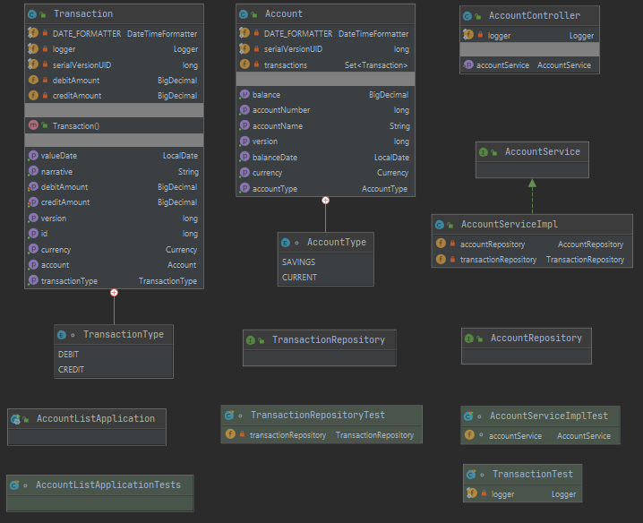
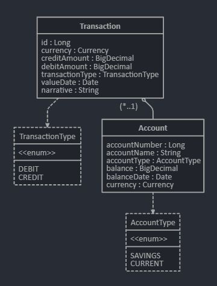
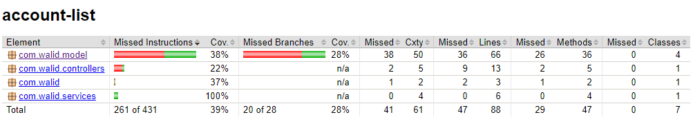

# Account Repository

## Overview
This is a Spring MVC project packaged and deployed as a Docker microservice. Transactions are persisted to an H2 database and retrieved via web interface.

## Main Features / Design Decisions
- Microservice deployed as a docker container with an inbuilt health check end point for runtime monitoring and management.
    - http://localhost:8080/actuator/health

- H2 in-memory database is initialised with transactions on start up and admin console is accessible.
    - http://localhost:8080/h2-console

## UML Class Diagram


## Entity/Relation Diagram


## Synopsis
To build (package) the docker image
```bash
$ ./mvnw clean package docker:build
```
To run the Docker container (Ctrl+C to remove container)
```bash
$ docker run -it --rm -p 8080:8080 --name account-list account-list
```

To check container status
```bash
$ docker ps
CONTAINER ID        IMAGE                              COMMAND                  CREATED             STATUS                    PORTS                                                  NAMES
fbd9c786ed5e        account-list                       "java -jar /app/acco…"   53 seconds ago      Up 51 seconds (healthy)   0.0.0.0:8080->8080/tcp                                 account-list
```

#### To list accounts: http://localhost:8080/accounts

## Test Coverage Report
